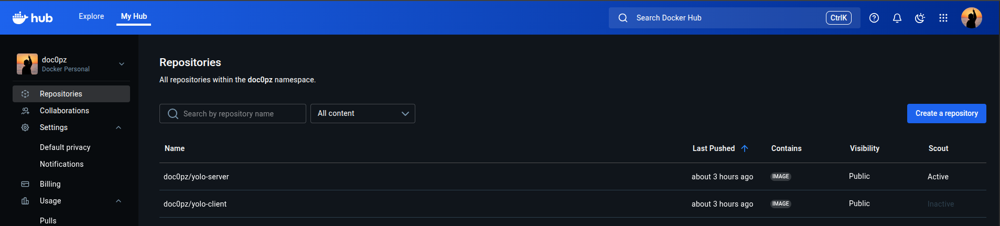

# YOLO E-commerce Platform

A containerized e-commerce application demonstrating microservice architecture with progressive automation using configuration management and infrastructure as code.

## Architecture Overview

The application consists of three main components:

- **Frontend**: React.js client served via lighttpd
- **Backend**: Node.js REST API server
- **Infrastructure**: Redis cache with MongoDB Atlas database

## Implementation Stages

### Stage 1: Microservice Containerization ✅

- **Approach**: Docker containerization with optimized multi-stage builds
- **Architecture**: 
  - **Backend**: 3-stage build with distroless runtime for security
  - **Frontend**: 2-stage build with lightweight web server(lighttpd)
  - **Database**: External MongoDB Atlas integration
  - **Cache**: Redis for session management
- **Network**: Hybrid networking (host mode for external connectivity, bridge for internal services)
- **Security**: Non-root users, distroless images, minimal attack surface
- **Details**: [Microservice Implementation Documentation](explanation-microservice.md)



#### Microservice Features
- **Multi-stage Builds**: Optimized images
- **External Database**: MongoDB Atlas cloud integration
- **Security Hardened**: Distroless backend, non-root execution
- **Performance Optimized**: Binary compression, symbol stripping

### Stage 2: Ansible Configuration Management ✅

- **Status**: Complete and functional
- **Approach**: Automated deployment via Ansible playbooks and Vagrant
- **Details**: [Ansible Automation Documentation](explanation-ansible.md)

### Stage 3: Terraform + Ansible Integration

- **Status**: Not yet available
- **Planned**: Infrastructure as Code with Terraform provisioning

## Quick Start

### Prerequisites

- Docker 20.10+
- Docker Compose 2.0+
- Vagrant 2.3+ (for automated deployment)
- VirtualBox 7.0+ (for automated deployment)
- Ansible 2.9+ (for automated deployment)

### Manual Container Deployment

```bash
# Clone repository
git clone <https://github.com/Vinge1718/yolo>
cd yolo

docker compose up --build

# Access application
# Frontend: http://localhost:3000
# Backend API: http://localhost:5002
```

#### Prerequisites for Manual Deployment
- Valid MongoDB Atlas connection string
- Docker and Docker Compose installed
- Ports 3000 and 5002 available

### Automated Deployment (Ansible + Vagrant)


## Monitoring & Debugging

### Manual Container Operations

```bash
# Check running containers
docker ps

# View container logs
docker compose logs server
docker compose logs client

# Check container resource usage
docker stats

# Restart specific service
docker compose restart server

# Rebuild specific service
docker compose up --build server

# Check MongoDB Atlas connectivity
docker compose logs server | grep -i mongo
```


### Application Health Checks

```bash
# Test frontend
curl http://192.168.56.10:3000

# Test backend API
curl http://192.168.56.10:5002/api/products

# Check specific service logs
docker compose logs redis
```

### Network Diagnostics

```bash
# View Docker networks
docker network ls

# Inspect application network
docker network inspect yolo_appnet

# Container connectivity test
docker exec server ping redis
```


### Role-Based Architecture

- **docker**: Installs Docker Engine and Docker Compose
- **git_clone**: Clones application repository
- **yolo_environment**: Creates required .env files
- **yolo_deploy**: Builds and starts containers

## Persistence & Data Management

### Database Storage

- **Provider**: MongoDB Atlas (cloud-hosted)
- **Persistence**: Products survive container restarts
- **Connection**: Configured via environment variables

## Testing Product Functionality

### For Manual Docker Deployment
1. Access frontend: <http://localhost:3000>
2. Navigate to "Add Product" section
3. Fill product form with:
   - Product name
   - Product price
   - Product description
4. Submit form
5. Verify product appears in product list
6. Test persistence by restarting containers:

   ```bash
   docker compose restart
   ```

**Port conflicts**:

```bash
# Check port usage
sudo lsof -i :3000
sudo lsof -i :5002
```

**Container startup failures**:

```bash
# Rebuild containers
docker compose down
docker compose up -d --build
```

**Permission issues**:

```bash
# Fix Docker permissions
sudo usermod -aG docker vagrant
```
